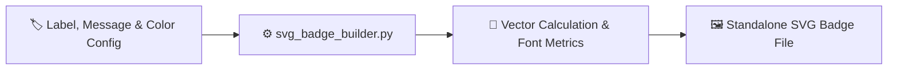

<div align="center">

# 🚀 svg-badge-builder

### *Standalone SVG status badge generator for READMEs and websites.*

[](https://github.com/TauqeerMustafa/svg-badge-builder/actions)
[](LICENSE)
[](https://www.python.org/)
[](svg_badge_builder.py)
[](CONTRIBUTING.md)

<br/>

<p align="center">
  <a href="#-why-use-svg-badge-builder">Why svg-badge-builder?</a> •
  <a href="#-instant-preview">Demo</a> •
  <a href="#-quick-start">Quick Start</a> •
  <a href="#-architecture">Architecture</a> •
  <a href="#-cli-reference">CLI Reference</a> •
  <a href="#-contributing">Contributing</a> •
  <a href="#-license">License</a>
</p>

</div>

---

## 💡 Why Use `svg-badge-builder`?

- **Zero Network Reliance**: Generates pixel-perfect SVG files locally without shields.io rate limits.
- **Color Customization**: Supports preset colors (`green`, `blue`, `purple`, `red`) and custom HEX codes.
- **Lightweight SVGs**: Produces clean, optimized vector assets ready for web and GitHub embedding.

---

## 🎬 Instant Preview

```bash
$ python svg_badge_builder.py --label "build" --message "passing" --color green --output badge.svg
✅ SVG badge generated successfully: badge.svg [build | passing]
```

---

## ⚡ Quick Start

```bash
# 1. Clone the repository
git clone https://github.com/TauqeerMustafa/svg-badge-builder.git
cd svg-badge-builder

# 2. Run CLI tool immediately (No pip install required)
python svg_badge_builder.py --help
```

---

## 🏛️ Architecture & Workflow



---

## 💻 CLI Reference

| Command | Description |
| :--- | :--- |
| `python svg_badge_builder.py --help` | Display full help menu and flag options |
| `python svg_badge_builder.py` | Run default execution mode |

---

## 🎨 Badge Style Presets & Examples

Easily generate clean, production-ready SVG badges with built-in color presets:

```bash
# Build a status badge (Passing - Green)
python svg_badge_builder.py --label "build" --message "passing" --color "4c1"

# Build a release version badge (v1.2.0 - Blue)
python svg_badge_builder.py --label "version" --message "v1.2.0" --color "007ec6"

# Build a license badge (MIT - Yellow-Green)
python svg_badge_builder.py --label "license" --message "MIT" --color "a4a61d"

# Custom badge with output filename
python svg_badge_builder.py --label "coverage" --message "98%" --color "brightgreen" --output coverage.svg
```

---

## 🤝 Contributing

Contributions, feature suggestions, and pull requests are warmly welcomed!
- Read our [Contributing Guidelines](CONTRIBUTING.md).
- Follow our [Code of Conduct](CODE_OF_CONDUCT.md).

---

## 📄 License

Distributed under the **MIT License**. See [`LICENSE`](LICENSE) for details.

<div align="center">
  <sub>Crafted with ❤️ for the open-source community by <a href="https://github.com/TauqeerMustafa">Tauqeer Mustafa</a>.</sub>
</div>
